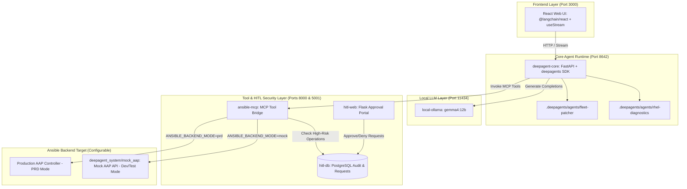

# Deep Agent Architecture & Design Document

## 1. System Overview & Modular Architecture

The **LangGraph Deep Agent (`deepagent_system`)** is designed as a decoupled, rootless microservice architecture. It provides an automated operational layer for enterprise RHEL High Availability (HA) cluster management with strict Human-in-the-Loop (HITL) approval security.



---

## 2. Rootless Podman & Container Isolation Strategy

### 2.1 Storage Configuration (`storage.conf`)
To support rootless Podman execution on RHEL/Linux without user namespace UID/GID mapping errors, the rootless storage configuration enforces:
```ini
[storage]
driver = "overlay"
ignore_chown_errors = "true"
```

### 2.2 Microservice Container Boundaries

Each component is containerized into a dedicated image to allow seamless updates:

| Service Name | Container Image | Port | Description |
| :--- | :--- | :--- | :--- |
| `ollama` | `localhost/local-ollama:gemma4-12b` | `11434` | Standalone local Ollama model engine |
| `deepagent-core` | `localhost/deepagent-core:latest` | `8642` | Python service running `deepagents` harness & REST API |
| `deepagent-webui` | `localhost/deepagent-webui:latest` | `3000` | React web application (`@langchain/react`) |
| `ansible-mcp` | `agent2_ansible-mcp:latest` | `8000` | MCP Server converting agent calls to AAP requests |
| `hitl-web` | `agent2_hitl-web:latest` | `5001` | Authentication & approval web portal |
| `hitl-db` | `agent2_hitl-db:latest` | `5432` | PostgreSQL database for HITL authorization states |
| `aap-server` | `localhost/deepagent-mock-aap:latest` | `5000` | Reusable Mock AAP server (`deepagent_system/mock_aap/`) |

---

## 3. Configurable Ansible Execution Mode (`ANSIBLE_BACKEND_MODE=mock|prd`)

### 3.1 Dual-Backend Architecture
To facilitate safe testing without risking physical infrastructure, the system implements a dual-mode Ansible adapter:
- **Testing & Staging (`ANSIBLE_BACKEND_MODE=mock`):** `ansible-mcp` connects to `aap-server:5000` (`deepagent_system/mock_aap/mock_aap.py`). All job templates, inventory queries, and cluster status checks return realistic mock data.
- **Production (`ANSIBLE_BACKEND_MODE=prd`):** `ansible-mcp` connects to the Production Red Hat Ansible Automation Platform controller specified by `AAP_HOST` and `AAP_TOKEN`.

### 3.2 Environment Variable Matrix (`.env.example`)
```env
# Ansible Backend Mode Selection
ANSIBLE_BACKEND_MODE=mock          # Options: 'mock' (default for testing) or 'prd' (for production)

# Mock AAP Settings (used when ANSIBLE_BACKEND_MODE=mock)
AAP_HOST_MOCK=aap-server:5000
AAP_TOKEN_MOCK=mock-token-123

# Production AAP Settings (used when ANSIBLE_BACKEND_MODE=prd)
AAP_HOST_PRD=https://aap.prd.enterprise.local
AAP_TOKEN_PRD=production-bearer-token-here
AAP_VERIFY_SSL=true
```

---

## 4. Microservice Interfaces & Data Flow

### 4.1 REST API Interface (`deepagent-core`)
- `POST /v1/chat/completions`: OpenAI-compatible endpoint.
- `GET /health`: Microservice readiness probe.

### 4.2 Dynamic Tool Discovery (`ansible-mcp`)
`deepagent-core` connects to `http://ansible-mcp:8000/mcp` on startup via `langchain-mcp-adapters` to discover available cluster tools (`ansible_pcs_health_check`, `ansible_reboot_host`, `ansible_install_package`, etc.).

### 4.3 Security Interception (HITL Security Gate)
1. `deepagent-core` calls a high-risk tool via `ansible-mcp`.
2. `ansible-mcp` recognizes the high-risk tag and creates a `PENDING` request record in `hitl-db`.
3. `ansible-mcp` enters a 2-second polling loop checking status in `hitl-db`.
4. Human operator reviews and approves the request in `hitl-web` (`http://localhost:5001`).
5. `ansible-mcp` detects state `GRANTED` and executes the task against AAP (Mock or PRD depending on mode), returning results to `deepagent-core`.
